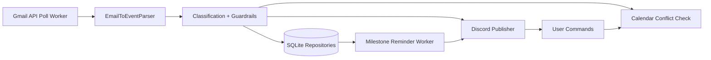

# Architecture & Design (Internal Reference)

This document is intentionally deeper than the main README and is meant for maintainers.

## System Architecture

## Core Design Goals

- Self-hosted and single-user by default
- Minimal setup burden for non-technical users
- Safety-first automation (never auto-book from inbound requests)
- Persistent state so restarts do not replay old notifications

## Runtime Components

- `src/server.ts`
  - App bootstrap
  - HTTP routes (`/`, `/health`, `/status`)
  - Discord command handling
  - Worker startup

- `src/workers/gmailPollWorker.ts`
  - Polls Gmail with `GMAIL_QUERY`
  - Uses checkpoint + dedupe
  - Parses events and publishes to Discord
  - Runs meeting conflict checks for detected requests
  - Auto-detects milestone completion emails and stops reminders

- `src/workers/milestoneReminderWorker.ts`
  - Periodically scans pending milestones
  - Reposts reminders until completion marker exists

- `src/integrations/discord/bot.ts`
  - Connects bot client
  - Publishes notifications into alerts channel
  - Handles command messages in channel

- `src/integrations/google/*`
  - Gmail fetch/parsing
  - Calendar free/busy and event creation
  - OAuth client creation using refresh token

## Data Model (SQLite)

Tables currently in `src/storage/sqlite.ts`:

- `events`
  - normalized events (message/project/application/milestone)
- `processed_events`
  - idempotency markers for dedupe
- `conversation_mappings`
  - conversation-to-channel context
- `milestone_completion`
  - completion markers
- `milestone_reminders`
  - last reminder timestamps
- `app_state`
  - misc persisted state (e.g., Gmail checkpoint)

## Event Pipeline

1. Gmail worker fetches candidate messages
2. Checkpoint filter removes old emails
3. Dedupe filter removes already-processed emails
4. Parser normalizes message into `NormalizedEvent`
5. Optional enrichment:
   - meeting request conflict check
   - milestone completion detection
6. Persist event + update state
7. Publish to Discord

## Safety Guardrails

- Inbound meeting request emails only notify users; no auto-create event
- Calendar event creation requires explicit user command
- Conflict check must pass before booking
- Milestones require explicit/manual or detected completion signal before reminders stop

## Operational Behavior

- First startup creates checkpoint at current time
- Subsequent runs process only newer messages
- If process restarts, SQLite keeps state (checkpoint, dedupe, reminders)

## Why SQLite (Current Choice)

Best fit for:
- single-user deployments
- simple self-hosted setup
- low operational overhead

When to migrate to Postgres:
- shared multi-tenant hosting
- higher write concurrency
- stronger managed backup/observability requirements

## Candidate V2+ Enhancements

- Feature flag to disable optional Riipen API codepath by default
- Replace text commands with slash commands for better UX
- Add confidence scoring + fallback route for parser misses
- Add retry queue backend for outbound actions
- Add structured metrics for polling/parse/publish success rates
